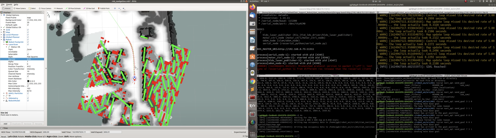

# **Mobile Robot using Arduino and Raspberry Pi**

This repository contains code for a self-driving mobile robot built using ROS, Arduino, and Raspberry Pi. The robot's body was created using a 3D printer, and it uses an Arduino Mega, a Raspberry Pi 4, and DC encoder motors. The software runs on Raspbian, and the SLAM package used is GMapping, while the Navi package uses teb_local_planner and dwa_local_planner. The robot has a camera attached, allowing you to see what it sees.

## **Packages**

This repository contains several ROS packages, each with its own purpose:

- **`motor_control`**: contains code for controlling the motors.
- **`rplidar_ros`**: uses an RPLIDAR A1 lidar sensor.
- **`usb_cam`**: allows the robot to use a USB camera.
- **`tf_broadcaster`**: broadcasts tf information.
- **`arduino`**: enables serial communication between Arduino and ROS.

In addition to these packages, this repository contains code for controlling the robot, generating maps, and planning paths. It also includes code related to the camera.

## **Requirements**

The following packages are required to run this project:

- ROS (Melodic Morenia)
- rosserial
- hls_lfcd_lds_driver
- mpu6050
- laser_filters
- usb_cam
- gmapping
- teb_local_planner
- dwa_local_planner

## **Demo**

[2021.06.29 teb_local_planner](https://www.youtube.com/watch?v=n-BzgKhvjr0)
